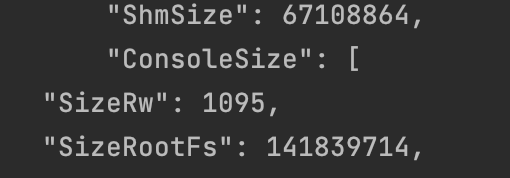
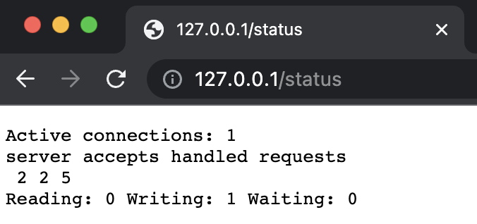
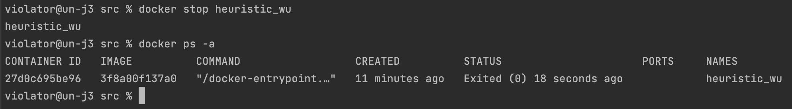
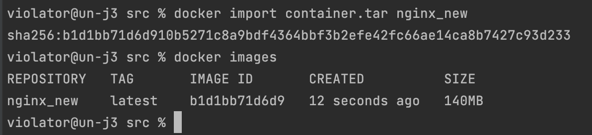

# Simple Docker

## Part 1. Готовый докер

* Взять официальный докер образ с nginx и выкачать его при помощи `docker pull`
  


* Проверить наличие докер образа через `docker images`
  


* Запустить докер образ через docker run -d [image_id|repository]


* Проверить, что образ запустился через `docker ps`


* Посмотреть информацию о контейнере через `docker inspect`

* По выводу команды определить и поместить в отчёт размер контейнера, список замапленных портов и ip контейнера:

* размер контейнера

* `docker inspect 0f7d3c19bb07  -s | grep -i size`

 

* список замапленных портов


* ip контейнера


* Остановить докер образ через `docker stop [container_id|container_name]`
* Проверить, что образ остановился через `docker ps`


* Запустить докер с замапленными портами 80 и 443 на локальную машину через команду run
* `sudo docker run -p 80:80 -p 443:443 -d 51086ed63d8c`


* Перезапустить докер контейнер через `docker restart [container_id|container_name]`

* `sudo docker restart de4cc98d105e`


* Проверить любым способом, что контейнер запустился

* `sudo docker ps`


## Part 2. Операции с контейнером

* Прочитать конфигурационный файл nginx.conf внутри докер контейнера через команду `exec`

* `docker exec silly_jennings find / -name "nginx.conf"`
* `docker exec silly_jennings cat /etc/nginx/nginx.conf`


* Создать на локальной машине файл nginx.confv

* `docker exec silly_jennings cat /etc/nginx/nginx.conf > nginx.conf`


* Настроить в нем по пути /status отдачу страницы статуса сервера nginx


* Скопировать созданный файл nginx.conf внутрь докер образа через команду docker cp


* `docker cp nginx.conf heuristic_wu:/etc/nginx/`


* Перезапустить nginx внутри докер образа через команду exec

* `docker exec heuristic_wu nginx -s reload`


* Проверить, что по адресу localhost:80/status отдается страничка со статусом сервера nginx



* Экспортировать контейнер в файл container.tar через команду export

* `docker export --output="container.tar" heuristic_wu`


* Остановить контейнер

* `docker stop heuristic_wu`



* Удалить образ через docker rmi [image_id|repository], не удаляя перед этим контейнеры

* `docker rmi nginx -f`


* Удалить остановленный контейнер

* `docker container ls -a`
* `docker container prune`


* Импортировать контейнер обратно через команду import

* `docker import container.tar nginx_new`



* Запустить импортированный контейнер

* `docker run -dit -p 80:80 b1d1bb71d6d9 bash`
* `docker ps`
* `docker exec awesome_elbakyan service nginx status`
* `docker exec awesome_elbakyan service nginx start`


## Part 3. Мини веб-сервер

* Написать мини сервер на C и FastCgi, который будет возвращать простейшую страничку с надписью Hello World!

```c
#include <fcgiapp.h>
#include <stdlib.h>
#include <stdio.h>

int main(void) {

  FCGX_Init();
  FCGX_Request req;
  FCGX_InitRequest(&req, 0, 0);

  while (FCGX_Accept_r(&req) >= 0) {
    FCGX_FPrintF(req.out, "Content-Type: text/html\n\n");
    FCGX_FPrintF(req.out, "hello world");
    FCGX_Finish_r(&req);
  }

return 0;
}
```

* Обновляем линукс `apt-get update` `apt-get upgrade`

* Устанавливаем необходимые библиотеки  `apt-get install -y gcc spawn-fcgi libfcgi-dev`

* Создаем исполняемый файл серевера `gcc server.c -lfcgi -o server`

* Запустить написанный мини сервер через spawn-fcgi на порту 8080

* `docker exec vio spawn-fcgi -p 8080 etc/nginx/server`

* Написать свой nginx.conf, который будет проксировать все запросы с 81 порта на 127.0.0.1:8080

```nginx configuration
    server {
        listen 81;
        listen [::]:81;
        server_name  localhost;
        location / {
            fastcgi_pass 127.0.0.1:8080;
        	include fastcgi_params;
        }
        location = /status {
        stub_status;
        }
    }
```

```shell
#!/bin/bash
docker stop vio
docker run -d --name vio -p 81:81 --rm nginx:latest
docker ps

docker cp server.c vio:/etc/nginx/
docker cp ./nginx/nginx.conf vio:/etc/nginx/

docker exec vio apt-get update
docker exec vio apt-get install -y gcc spawn-fcgi libfcgi-dev
docker exec vio gcc /etc/nginx/server.c -lfcgi -o /etc/nginx/server
docker exec vio spawn-fcgi -p 8080 etc/nginx/server
docker exec vio nginx -s reload

echo
curl 127.0.0.1:81
echo
echo
curl 127.0.0.1:81/status

```

## Part 4. Свой докер

Теперь всё готово. Можно приступать к написанию докер образа для созданного сервера.

**== Задание ==**

*При написании докер образа избегайте множественных вызовов команд RUN*

#### Написать свой докер образ, который:
##### 1) собирает исходники мини сервера на FastCgi из [Части 3](#part-3-мини-веб-сервер)

```dockerfile
FROM nginx
WORKDIR /server
COPY . .
COPY nginx ../etc/nginx/
RUN  \
    apt-get update && \
    apt-get install -y \
    gcc  \
    spawn-fcgi  \
    libfcgi-dev && \
    rm -rf /var/lib/apt/lists/* && \
    gcc server.c -lfcgi -o server && \
    chmod +x server_run.sh

ENTRYPOINT ["./server_run.sh"]

```
##### 2) запускает его на 8080 порту

```shell
spawn-fcgi -p 8080 ./server
```
##### 3) копирует внутрь образа написанный *./nginx/nginx.conf*
##### 4) запускает **nginx**.
* `nginx -g "daemon off;"`


_**nginx** можно установить внутрь докера самостоятельно, а можно воспользоваться готовым образом с **nginx**'ом, как базовым._

##### Собрать написанный докер образ через `docker build` при этом указав имя и тег

* `docker build . -t my_nginx:1.0`

##### Проверить через `docker images`, что все собралось корректно
##### Запустить собранный докер образ с маппингом 81 порта на 80 на локальной машине и маппингом папки *./nginx* внутрь контейнера по адресу, где лежат конфигурационные файлы **nginx**'а (см. [Часть 2](#part-2-операции-с-контейнером))

* `docker run -d --name vio4 -p 80:81 -v /Users/violator/DO5_SimpleDocker-0/src/nginx/nginx.conf:/etc/nginx/nginx.conf --rm  my_nginx:test`

##### Проверить, что по localhost:80 доступна страничка написанного мини сервера
##### Дописать в *./nginx/nginx.conf* проксирование странички */status*, по которой надо отдавать статус сервера **nginx**
##### Перезапустить докер образ
*Если всё сделано верно, то, после сохранения файла и перезапуска контейнера, конфигурационный файл внутри докер образа должен обновиться самостоятельно без лишних действий*
##### Проверить, что теперь по *localhost:80/status* отдается страничка со статусом **nginx**

```shell
#!/bin/bash
spawn-fcgi -p 8080 ./server
nginx -g "daemon off;"```
```

````shell
#!/bin/bash
docker stop vio4
docker images
docker rmi my_nginx:1.0
docker build . -t my_nginx:1.0
docker run -d --name vio4 -p 80:81 -v /Users/violator/DO5_SimpleDocker-0/src/nginx/nginx.conf:/etc/nginx/nginx.conf --rm  my_nginx:1.0
docker ps
echo
curl 127.0.0.1:80
echo
echo
curl 127.0.0.1:80/status
````


## Part 5. **Dockle**

После написания образа никогда не будет лишним проверить его на безопасность.

**== Задание ==**

##### Просканировать образ из предыдущего задания через `dockle [image_id|repository]`
##### Исправить образ так, чтобы при проверке через **dockle** не было ошибок и предупреждений

* `brew install goodwithtech/r/dockle`

* `dockle --accept-key=NGINX_GPGKEY my_nginx:1.0`

```dockerfile
FROM nginx
WORKDIR /server
COPY server.c .
COPY server_run.sh .
COPY nginx ../etc/nginx/
RUN  \
    touch /var/run/nginx.pid && \
    chown -R nginx:nginx /var/run/nginx.pid && \
    chown -R nginx:nginx /var/log/nginx && \
    chown -R nginx:nginx /var/cache/nginx && \
    apt-get update && \
    apt-get install -y \
    gcc  \
    spawn-fcgi  \
    libfcgi-dev && \
    rm -rf /var/lib/apt/lists/* && \
    gcc server.c -lfcgi -o server && \
    chmod +x server_run.sh \
    && chmod 777 /home \
    && chmod 755 /sbin/unix_chkpwd \
    && chmod u-s /usr/bin/chsh \
    && chmod u-g /usr/bin/chsh \
    && chmod 755 /usr/bin/chage \
    && chmod u-s /bin/su \
    && chmod u-g /bin/su \
    && chmod 755 /usr/bin/wall \
    && chmod u-s /usr/bin/chfn \
    && chmod u-g /usr/bin/chfn \
    && chmod u-s /usr/bin/gpasswd \
    && chmod u-g /usr/bin/gpasswd \
    && chmod u-s /bin/mount \
    && chmod u-g /bin/mount \
    && chmod u-s /usr/bin/newgrp \
    && chmod u-g /usr/bin/newgrp \
    && chmod 755 /usr/bin/expiry \
    && chmod u-s /bin/umount \
    && chmod u-g /bin/umount \
    && chmod u-s /usr/bin/passwd \
    && chmod u-g /usr/bin/passwd

USER nginx


ENTRYPOINT ["./server_run.sh"]

HEALTHCHECK --interval=5m --timeout=3s \
  CMD curl -f http://localhost/ || exit 1


```

* `export DOCKER_CONTENT_TRUST=1`


## Part 6. Базовый **Docker Compose**

Вот вы и закончили вашу разминку. А хотя погодите...
Почему бы не поэкспериментировать с развёртыванием проекта, состоящего сразу из нескольких докер образов?

**== Задание ==**

##### Написать файл *docker-compose.yml*, с помощью которого:
##### 1) Поднять докер контейнер из [Части 5](#part-5-инструмент-dockle) _(он должен работать в локальной сети, т.е. не нужно использовать инструкцию **EXPOSE** и мапить порты на локальную машину)_
##### 2) Поднять докер контейнер с **nginx**, который будет проксировать все запросы с 8080 порта на 81 порт первого контейнера
##### Замапить 8080 порт второго контейнера на 80 порт локальной машины

```dockerfile
version: "3"

services:
  server:
    build: ../part_5/
  nginx:
    image: nginx
    ports:
      - "80:8080"
    volumes:
      - ./nginx.conf:/etc/nginx/nginx.conf
```

##### Остановить все запущенные контейнеры
##### Собрать и запустить проект с помощью команд `docker-compose build` и `docker-compose up`
##### Проверить, что в браузере по *localhost:80* отдается написанная вами страничка, как и ранее

* перебилдить и запустить
* `docker-compose up --build -d`

* остановить
* `docker-compose down  `

* проверить запущенные контейнеры
* `docker ps -a `